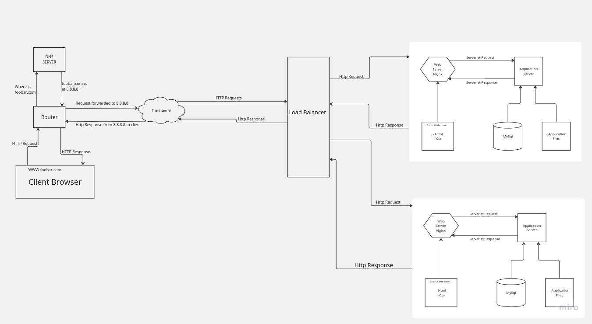
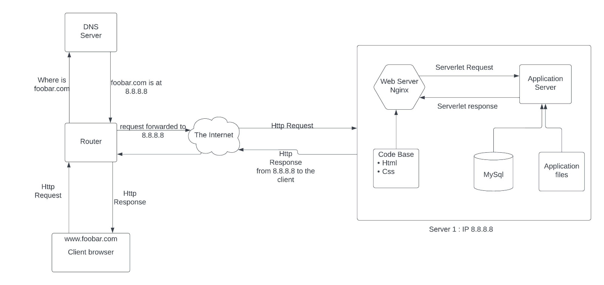
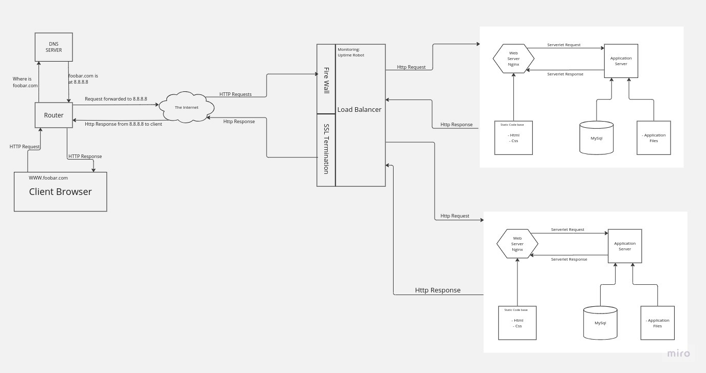
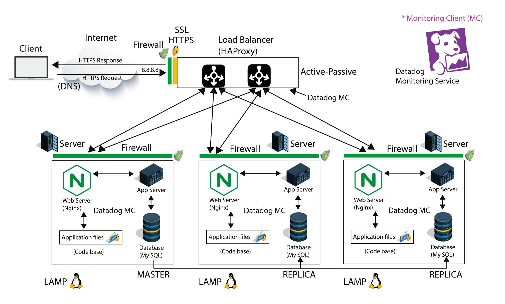
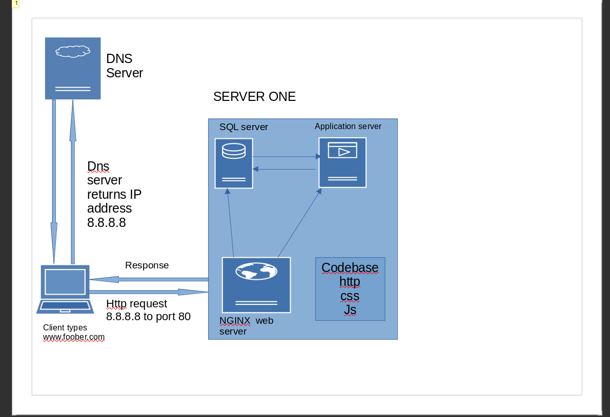

What is a network protocol?
A network protocol is a set of established rules that specify how to format, send and receive data so that computer network endpoints, including computers, servers, routers and virtual machines, can communicate despite differences in their underlying infrastructures, designs or standards.

To successfully send and receive information, devices on both sides of a communication exchange must accept and follow protocol conventions. In networking, support for protocols can be built into the software, hardware or both.

Without network protocols, computers and other devices would not know how to engage with each other. As a result, except for specialty networks built around a specific architecture, few networks would be able to function, and the internet as we know it wouldn't exist. Virtually all network end users rely on network protocols for connectivity.

How network protocols work: The OSI model
Network protocols break larger processes into discrete, narrowly defined functions and tasks across every level of the network. In the standard model, known as the Open Systems Interconnection (OSI) model, one or more network protocols govern activities at each layer in the telecommunication exchange. Lower layers deal with data transport, while the upper layers in the OSI model deal with software and applications.

To understand how network protocols function, it's crucial to understand the workings of the seven layers of the OSI model:

Physical layer. The physical layer is the initial layer that physically connects two interoperable systems. It controls simplex or duplex modem transmissions and transfers data in bits. Additionally, it oversees the hardware that connects the network interface card (NIC) to the network, including the wiring, cable terminators, topography and voltage levels.
Data-link layer. The data-link layer is responsible for the error-free delivery of data from one node to another over the physical layer. It's also the firmware layer of the NIC. It puts datagrams together into frames and gives each frame the start and stop flags. Additionally, it fixes issues brought on by broken, misplaced or duplicate frames.
Network layer. The network layer is concerned with information flow regulation, switching and routing between workstations. Additionally, it divides up datagrams from the transport layer into error-free and smaller datagrams.
Transport layer. The transport layer transfers services from the network layer to the application layer and breaks down data into data frames for error checking at the network segment level. This also ensures that a fast host on a network doesn't overtake a slower one. Essentially, the transport layer ensures that the entire message is delivered from beginning to end. It also confirms a successful data transmission and retransmitting of the data if an error is discovered.
Session layer. The session layer establishes a connection between two workstations that need to communicate. In addition to ensuring security, this layer oversees connection establishment, session maintenance and authentication.
Presentation layer. The presentation layer is also known as the translation layer because it retrieves the data from the application layer and formats it for transmission over the network. It addresses the proper representation of data, including the syntax and semantics of information. The presentation layer is also in charge of managing file-level security and transforming data to network standards.
Application layer. The application layer, which is the top layer of the network, oversees relaying user application requests to lower levels. File transfer, email, remote login, data entry and other common applications take place at this layer.

Monitoring
Just as the heart monitor in a hospital that is making sure that a patient’s heart is beating and at the right beat, software monitoring will watch computer metrics, record them, and emit an alert if something is unusual or that could make the computer not work properly happens.

You cannot fix or improve what you cannot measure is a famous saying in the tech industry. In the age of the data-ism, monitoring how our software systems are doing is an important thing.

Web stack monitoring can be broken down into 2 categories:

Application monitoring: getting data about your running software and making sure it is behaving as expected
Server monitoring: getting data about your virtual or physical server and making sure they are not overloaded (could be CPU, memory, disk or network overload)
Here are few famous monitoring tools:
NewRelic
NewRelic requires you to add a piece of JavaScript to your website, this agent will collect information and send it back to the New Relic servers. It will give you a detailed analysis of how quickly your website loads in a browser, with a detailed analysis at every level of the stack. If the website is loading too slowly or users are experiencing error (500), there is a feature that allows you to trigger an alert. NewRelic now does much more than this, I’ll let you discover the rest.

DataDog
DataDog allows you to measure and monitor everything with graphs. It gathers performance data from all your application components. The service has a lot of integrations. You usually just need to properly configure your alert and you are good to go with solid monitoring coverage.

Uptime Robot
Uptime Robot is a simple service that will check that your website is responding from multiple locations in the world. This is the bare minimum when you host a website.

Nagios
Nagios is an open source project started in 1999, it is among the most widely used monitoring tools in the tech industry. It is, however, seen as outdated. Nagios had trouble adapting to the rise of the Cloud but is slowly trying to catch up.

WaveFront
Wavefront is a cutting edge monitoring service funded by great software engineers who’ve built monitoring tools for the best tech companies in Silicon Valley. The idea is to be able to analyze anything that can produce data points. A query language that looks like SQL allows users to apply mathematical operations to these data points to extract values or detect anomalies from the time series data. While it takes some time to get used to the tool, it’s the type of monitoring that the best companies are using. To my knowledge, LinkedIn, Facebook and DropBox are using a very similar tool for their monitoring needs.

