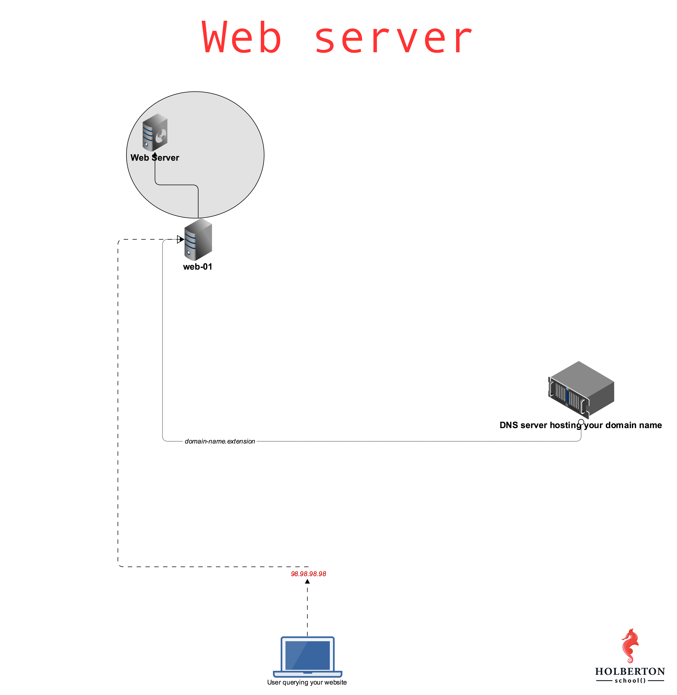

# WEB SERVER

How the web works provides a simplified view of what happens when you view a webpage in a web browser on your computer or phone.

This theory is not essential to writing web code in the short term, but before long you'll really start to benefit from understanding what's happening in the background.

Clients and servers
Computers connected to the internet are called clients and servers. A simplified diagram of how they interact might look like this:

Two circles representing client and server. An arrow labelled request is going from client to server, and an arrow labelled responses is going from server to client
Clients are the typical web user's internet-connected devices (for example, your computer connected to your Wi-Fi, or your phone connected to your mobile network) and web-accessing software available on those devices (usually a web browser like Firefox or Chrome).
Servers are computers that store webpages, sites, or apps. When a client device wants to access a webpage, a copy of the webpage is downloaded from the server onto the client machine to be displayed in the user's web browser.
The other parts of the toolbox
The client and server we've described above don't tell the whole story. There are many other parts involved, and we'll describe them below.

For now, let's imagine that the web is a road. On one end of the road is the client, which is like your house. On the other end of the road is the server, which is a shop you want to buy something from.

A black-and-white photo of a person crossing a road at a crosswalk
In addition to the client and the server, we also need to say hello to:

Your internet connection: Allows you to send and receive data on the web. It's basically like the street between your house and the shop.
TCP/IP: Transmission Control Protocol and Internet Protocol are communication protocols that define how data should travel across the internet. This is like the transport mechanisms that let you place an order, go to the shop, and buy your goods. In our example, this is like a car or a bike (or however else you might get around).
DNS: Domain Name System is like an address book for websites. When you type a web address in your browser, the browser looks at the DNS to find the website's IP address before it can retrieve the website. The browser needs to find out which server the website lives on, so it can send HTTP messages to the right place (see below). This is like looking up the address of the shop so you can access it.
HTTP: Hypertext Transfer Protocol is an application protocol that defines a language for clients and servers to speak to each other. This is like the language you use to order your goods.
Component files: A website is made up of many different files, which are like the different parts of the goods you buy from the shop. These files come in two main types:
Code files: Websites are built primarily from HTML, CSS, and JavaScript, though you'll meet other technologies a bit later.
Assets: This is a collective name for all the other stuff that makes up a website, such as images, music, video, Word documents, and PDFs.
So what happens, exactly?
When you type a web address into your browser (for our analogy that's like walking to the shop):

The browser goes to the DNS server, and finds the real address of the server that the website lives on (you find the address of the shop).
The browser sends an HTTP request message to the server, asking it to send a copy of the website to the client (you go to the shop and order your goods). This message, and all other data sent between the client and the server, is sent across your internet connection using TCP/IP.
If the server approves the client's request, the server sends the client a "200 OK" message, which means "Of course you can look at that website! Here it is", and then starts sending the website's files to the browser as a series of small chunks called data packets (the shop gives you your goods, and you bring them back to your house).
The browser assembles the small chunks into a complete web page and displays it to you (the goods arrive at your door — new shiny stuff, awesome!).
Order in which component files are parsed
When browsers send requests to servers for HTML files, those HTML files often contain <link> elements referencing external CSS stylesheets and <script> elements referencing external JavaScript scripts. It's important to know the order in which those files are parsed by the browser as the browser loads the page:

The browser parses the HTML file first, and that leads to the browser recognizing any <link>-element references to external CSS stylesheets and any <script>-element references to scripts.
As the browser parses the HTML, it sends requests back to the server for any CSS files it has found from <link> elements, and any JavaScript files it has found from <script> elements, and from those, then parses the CSS and JavaScript.
The browser generates an in-memory DOM tree from the parsed HTML, generates an in-memory CSSOM structure from the parsed CSS, and compiles and executes the parsed JavaScript.
As the browser builds the DOM tree and applies the styles from the CSSOM tree and executes the JavaScript, a visual representation of the page is painted to the screen, and the user sees the page content and can begin to interact with it.
DNS explained
Real web addresses aren't the nice, memorable strings you type into your address bar to find your favorite websites. They are special numbers that look like this: 192.0.2.172.

This is called an IP address, and it represents a unique location on the web. However, it's not very easy to remember, is it? That's why the Domain Name System was invented. This system uses special servers that match up a web address you type into your browser (like "mozilla.org") to the website's real (IP) address.

Websites can be reached directly via their IP addresses. You can use a DNS lookup tool to find the IP address of a website.

Packets explained
Earlier we used the term "packets" to describe the format in which the data is sent from server to client. What do we mean here? Basically, when data is sent across the web, it is sent in thousands of small chunks. There are multiple reasons why data is sent in small packets. They are sometimes dropped or corrupted, and it's easier to replace small chunks when this happens. Additionally, the packets can be routed along different paths, making the exchange faster and allowing many different users to download the same website at the same time. If each website was sent as a single big chunk, only one user could download it at a time, which obviously would make the web very inefficient and not much fun to use.

.main-page-content a:not(.button):active {
    background-color: var(--text-link);
    color: #fff;
}
.main-page-content a:not(.button) {
    color: var(--text-link);
    width: -webkit-fit-content;
    width: -moz-fit-content;
    width: fit-content;
}
.about-container a:focus, .about-container a:hover, .main-page-content a:focus, .main-page-content a:hover {
    text-decoration: none;
}
.about-container a:link, .about-container a:visited, .main-page-content a:link, .main-page-content a:visited {
    text-decoration: underline;
}
a:not([class]) {
    -webkit-text-decoration-skip: ink;
    text-decoration-skip-ink: auto;
}
a {
    color: var(--text-link);
}
a {
    text-decoration: none;
}
*, :after, :before {
    box-sizing: border-box;
}
user agent stylesheet
a:-webkit-any-link:active {
    color: -webkit-activelink;
}
user agent stylesheet
a:-webkit-any-link {
    color: -webkit-link;
    cursor: pointer;
    text-decoration: underline;
}
user agent stylesheet
li {
    text-align: -webkit-match-parent;
}
.main-page-content ul {
    list-style: disc;
}
ol, ul {
    list-style: none;
    padding: 0;
}
user agent stylesheet
ul {
    list-style-type: disc;
}
.main-page-content {
    overflow-wrap: break-word;
    padding: 3rem 1rem 1rem;
}
.category-learn {
    --background-toc-active: var(--learn-accent-background-color);
    --category-color: var(--learn-accent-color);
    --category-color-engage: var(--learn-accent-engage);
    --category-color-background: var(--learn-accent-background-color);
    --mark-color: var(--api-mark-color);
}
:root, body {
    --mdn-color-white: #fff;
    --mdn-color-black: #000;
    --mdn-color-ads: #00d0aa;
    --mdn-color-background-highlight: #f0e498;
    --mdn-color-dark-grey: #4e4e4e;
    --mdn-background-dark: #1b1b1b;
    --mdn-background-light: #fff;
    --mdn-background-light-grey: #e2e2e2;
    --color-announcement-banner-accent: #ff6d91;
}
body {
    accent-color: var(--accent-primary);
    background-color: var(--background-primary);
    color: var(--text-primary);
    scrollbar-color: var(--scrollbar-color) var(--scrollbar-bg);
}
body {
    font-family: Inter,BlinkMacSystemFont,Segoe UI,Roboto,Oxygen,Ubuntu,Cantarell,Fira Sans,Droid Sans,Helvetica Neue,sans-serif;
    font-family: var(--font-body);
    font-size: 100%;
    font-size: var(--base-font-size);
    line-height: 1.75;
    line-height: var(--font-content-line-height);
    text-rendering: optimizeSpeed;
}
.dark {
    --text-primary: #fff;
    --text-secondary: #cdcdcd;
    --text-inactive: #cdcdcda6;
    --text-link: #8cb4ff;
    --text-invert: #1b1b1b;
    --background-primary: #1b1b1b;
    --background-secondary: #343434;
    --background-tertiary: #4e4e4e;
    --background-toc-active: #343434;
    --background-mark-yellow: rgba(199,183,0,.4);
    --background-mark-green: rgba(0,208,97,.4);
    --background-information: rgba(0,133,242,.1);
    --background-warning: rgba(255,42,81,.1);
    --background-critical: rgba(211,0,56,.1);
    --background-success: rgba(0,121,54,.1);
    --border-primary: #858585;
    --border-secondary: #696969;
    --button-primary-default: #fff;
    --button-primary-hover: #cdcdcd;
    --button-primary-active: #9e9e9e;
    --button-primary-inactive: #fff;
    --button-secondary-default: #4e4e4e;
    --button-secondary-hover: #858585;
    --button-secondary-active: #9e9e9e;
    --button-secondary-inactive: #4e4e4e;
    --button-secondary-border-focus: #0085f2;
    --button-secondary-border-red: #ff97a0;
    --button-secondary-border-red-focus: #ffd9dc;
    --icon-primary: #fff;
    --icon-secondary: #b3b3b3;
    --icon-information: #5e9eff;
    --icon-warning: #afa100;
    --icon-critical: #ff707f;
    --icon-success: #00b755;
    --accent-primary: #5e9eff;
    --accent-primary-engage: rgba(94,158,255,.1);
    --accent-secondary: #5e9eff;
    --accent-tertiary: rgba(0,133,242,.1);
    --shadow-01: 0 1px 2px rgba(251,251,254,.2);
    --shadow-02: 0 1px 6px rgba(251,251,254,.2);
    --focus-01: 0 0 0 3px rgba(251,251,254,.5);
    --field-focus-border: #fff;
    --code-token-tag: #c1cff1;
    --code-token-punctuation: #b3b3b3;
    --code-token-attribute-name: #ff97a0;
    --code-token-attribute-value: #00d061;
    --code-token-comment: #b3b3b3;
    --code-token-default: #fff;
    --code-token-selector: #bea5ff;
    --code-background-inline: #343434;
Show All Properties (75 more)
}
@media screen and (min-width: 769px)
:root {
    --type-heading-h1: 600 var(--type-heading-h1-font-size) /var(--heading-line-height) var(--font-heading);
    --type-heading-h2: 500 var(--type-heading-h2-font-size) /var(--heading-line-height) var(--font-heading);
    --type-heading-h3: 300 var(--type-heading-h3-font-size) /var(--heading-line-height) var(--font-heading);
    --type-heading-h4: 400 var(--type-heading-h4-font-size) /var(--heading-line-height) var(--font-heading);
}
:root {
    --font-fallback: BlinkMacSystemFont,"Segoe UI","Roboto","Oxygen","Ubuntu","Cantarell","Fira Sans","Droid Sans","Helvetica Neue",sans-serif;
    --font-body: Inter,var(--font-fallback);
    --font-heading: Inter,var(--font-fallback);
    --font-code: Menlo,Consolas,Monaco,Liberation Mono,Lucida Console,monospace;
    --base-font-size: 100%;
    --base-line-height: 1.2;
    --intermediate-line-height: 1.5;
    --heading-line-height: var(--base-line-height);
    --heading-letter-spacing: -0.031rem;
    --font-content-line-height: 1.75;
    --font-body-strong-weight: 600;
    --type-heading-h1-font-size: 2.488rem;
    --type-heading-h2-font-size: 2.074rem;
    --type-heading-h3-font-size: 1.728rem;
    --type-heading-h4-font-size: 1.44rem;
    --type-heading-h5-font-size: 1.2rem;
    --type-base-font-size-rem: 1rem;
    --type-smaller-font-size: 0.833rem;
    --type-tiny-font-size: 0.694rem;
    --type-heading-h1-font-size-mobile: 1.802rem;
    --type-heading-h2-font-size-mobile: 1.602rem;
    --type-heading-h3-font-size-mobile: 1.424rem;
    --type-heading-h4-font-size-mobile: 1.266rem;
    --type-emphasis-m: var(--font-body-strong-weight) var(--type-smaller-font-size) /1.23 var(--font-body);
    --type-label-s: 600 var(--type-tiny-font-size) /1.2 var(--font-heading);
    --type-heading-h1: 600 var(--type-heading-h1-font-size-mobile) /var(--heading-line-height) var(--font-heading);
    --type-heading-h2: 500 var(--type-heading-h2-font-size-mobile) /var(--heading-line-height) var(--font-heading);
    --type-heading-h3: 300 var(--type-heading-h3-font-size-mobile) /var(--heading-line-height) var(--font-heading);
    --type-heading-h4: 400 var(--type-heading-h4-font-size-mobile) /var(--heading-line-height) var(--font-heading);
    --type-heading-h5: 400 var(--type-heading-h5-font-size) /var(--heading-line-height) var(--font-heading);
    --type-heading-h6: 400 var(--type-base-font-size-rem) /var(--heading-line-height) var(--font-heading);
    --type-article-p: 400 var(--type-base-font-size-rem) /var(--font-content-line-height) var(--font-body);
    --max-width: 1440px;
    --gutter: 1rem;
    --top-navigation-height: 4rem;
    --top-navigation-offset: -4rem;
    --top-banner-inner-height: 3.125rem;
    --top-banner-height: calc(var(--top-banner-inner-height) + 0.25rem);
    --top-banner-outer-height: calc(var(--top-banner-height) + 2px);
    --z-index-a11y: 10000;
    --z-index-modal-content: 801;
    --z-index-modal-overlay: 800;
    --z-index-main-header: 700;
    --z-index-sidebar-mobile: 600;
    --z-index-mid: 500;
    --z-index-nav-menu: 200;
    --z-index-search-results: 101;
    --z-index-low: 100;
    --z-index-search-results-home: 99;
    --z-index-back: -1;
Show All Properties (7 more)
}
*, :after, :before {
    box-sizing: border-box;
}
*, :after, :before {
    box-sizing: border-box;
}


log.js:15 (Glean.core.Upload.PingUploadManager) Ping 79b29d22-a908-4fd0-b364-1d90dcd4a8c7 successfully sent 200.
log.js:15 (Glean.core.Upload.PingUploadManager) Ping a7b9535f-3537-4186-8f6d-8648385b4d1d successfully sent 200.
log.js:15 (Glean.core.Upload.PingUploadManager) Ping a4efbd4b-3b6b-44e4-8d3b-8a00432aeb14 successfully sent 200.
log.js:15 (Glean.core.Upload.PingUploadManager) Ping 2565de7f-d34e-410d-a690-dd9c1aa3b63b successfully sent 200.
How_the_Web_works:1 Refused to load the stylesheet 'https://fonts.googleapis.com/css?family=Open+Sans:300,400,600' because it violates the following Content Security Policy directive: "style-src 'report-sample' 'self' 'unsafe-inline'". Note that 'style-src-elem' was not explicitly set, so 'style-src' is used as a fallback.
DevTools failed to load source map: Could not load content for chrome-extension://amfojhdiedpdnlijjbhjnhokbnohfdfb/js/effector.es.js.map: System error: net::ERR_BLOCKED_BY_CLIENT
DevTools failed to load source map: Could not load content for chrome-extension://amfojhdiedpdnlijjbhjnhokbnohfdfb/captureToText/assets/js/material.min.js.map: System error: net::ERR_BLOCKED_BY_CLIENT
DevTools failed to load source map: Could not load content for chrome-extension://amfojhdiedpdnlijjbhjnhokbnohfdfb/js/gpt3-tokenizer.js.map: System error: net::ERR_BLOCKED_BY_CLIENT


