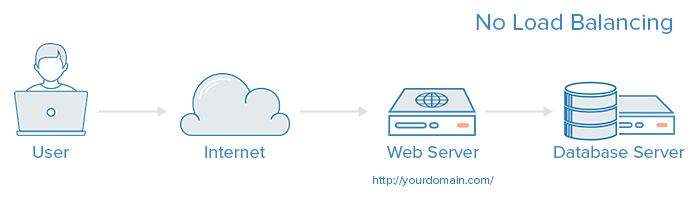
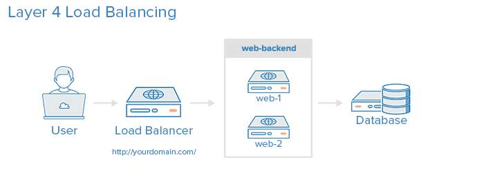
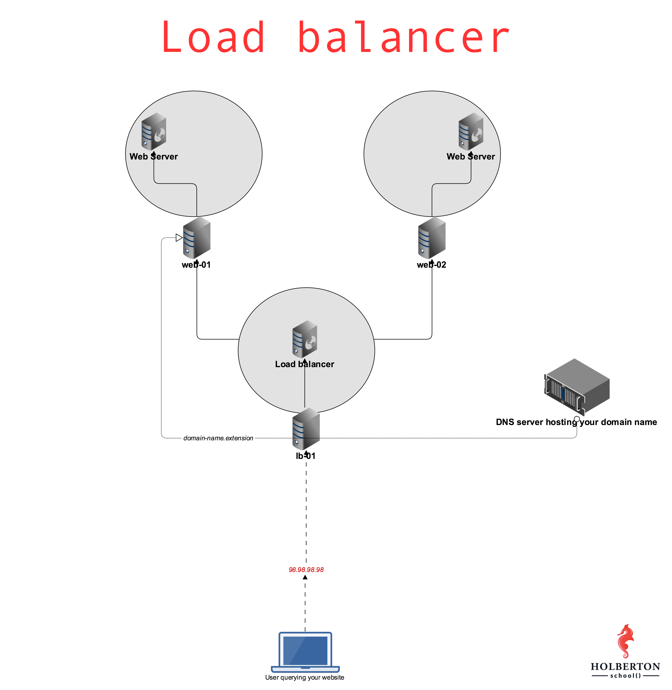
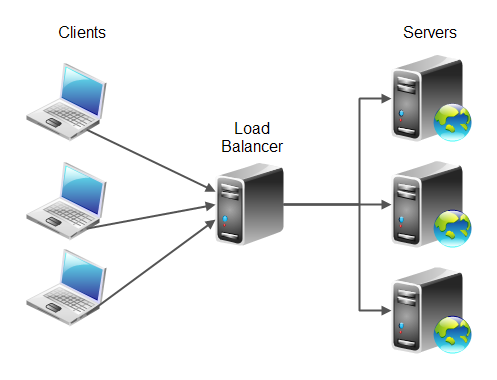

# Load balancer

## An Introduction to HAProxy and Load Balancing Concepts

HAProxy, which stands for High Availability Proxy, is a popular open source software TCP/HTTP Load Balancer and proxying solution which can be run on Linux, macOS, and FreeBSD. Its most common use is to improve the performance and reliability of a server environment by distributing the workload across multiple servers (e.g. web, application, database). It is used in many high-profile environments, including: GitHub, Imgur, Instagram, and Twitter.

In this guide, you’ll get a general overview of what HAProxy is, review load-balancing terminology, and examples of how it might be used to improve the performance and reliability of your own server environment.

HAProxy Terminology
There are many terms and concepts that are important when discussing load balancing and proxying. You’ll go over commonly used terms in the following subsections.

Before you get into the basic types of load balancing, you should begin with a review of ACLs, backends, and frontends.

Access Control List (ACL)
In relation to load balancing, ACLs are used to test some condition and perform an action (e.g. select a server, or block a request) based on the test result. Use of ACLs allows flexible network traffic forwarding based on a variety of factors like pattern-matching and the number of connections to a backend, for example.

Example of an ACL:

acl url_blog path_beg /blog
This ACL is matched if the path of a user’s request begins with /blog. This would match a request of http://yourdomain.com/blog/blog-entry-1, for example.

For a detailed guide on ACL usage, check out the HAProxy Configuration Manual.

Backend
A backend is a set of servers that receives forwarded requests. Backends are defined in the backend section of the HAProxy configuration. In its most basic form, a backend can be defined by:

which load balance algorithm to use
a list of servers and ports
A backend can contain one or many servers in it. Generally speaking, adding more servers to your backend will increase your potential load capacity by spreading the load over multiple servers. Increased reliability is also achieved through this manner, in case some of your backend servers become unavailable.

Here is an example of a two backend configuration, web-backend and blog-backend with two web servers in each, listening on port 80:

backend web-backend
   balance roundrobin
   server web1 web1.yourdomain.com:80 check
   server web2 web2.yourdomain.com:80 check
   
backend blog-backend
   balance roundrobin
   mode http
   server blog1 blog1.yourdomain.com:80 check
   server blog1 blog1.yourdomain.com:80 check
balance roundrobin line specifies the load balancing algorithm, which is detailed in the Load Balancing Algorithms section.

mode http specifies that layer 7 proxying will be used, which is explained in the Types of Load Balancing section.

The check option at the end of the server directives specifies that health checks should be performed on those backend servers.

Frontend
A frontend defines how requests should be forwarded to backends. Frontends are defined in the frontend section of the HAProxy configuration. Their definitions are composed of the following components:

a set of IP addresses and a port (e.g. 10.1.1.7:80, *:443, etc.)
ACLs
use_backend rules, which define which backends to use depending on which ACL conditions are matched, and/or a default_backend rule that handles every other case
A frontend can be configured to various types of network traffic, as explained in the next section.

Types of Load Balancing
Now that you have an understanding of the basic components that are used in load balancing, you can move into the basic types of load balancing.

No Load Balancing
A simple web application environment with no load balancing might look like the following:

No Load Balancing
No Load Balancing
In this example, the user connects directly to your web server, at yourdomain.com and there is no load balancing. If your single web server goes down, the user will no longer be able to access your web server. Additionally, if many users are trying to access your server simultaneously and it is unable to handle the load, they may have a slow experience or they may not be able to connect at all.

Layer 4 Load Balancing
The simplest way to load balance network traffic to multiple servers is to use layer 4 (transport layer) load balancing. Load balancing this way will forward user traffic based on IP range and port (i.e. if a request comes in for http://yourdomain.com/anything, the traffic will be forwarded to the backend that handles all the requests for yourdomain.com on port 80). For more details on layer 4, check out the TCP subsection of our Introduction to Networking.

Here is a diagram of a simple example of layer 4 load balancing:

Layer 4 Load Balancing
Layer 4 Load Balancing
The user accesses the load balancer, which forwards the user’s request to the web-backend group of backend servers. Whichever backend server is selected will respond directly to the user’s request. Generally, all of the servers in the web-backend should be serving identical content–otherwise the user might receive inconsistent content. Note that both web servers connect to the same database server.

Layer 7 Load Balancing
Another, more complex way to load balance network traffic is to use layer 7 (application layer) load balancing. Using layer 7 allows the load balancer to forward requests to different backend servers based on the content of the user’s request. This mode of load balancing allows you to run multiple web application servers under the same domain and port. For more details on layer 7, check out the HTTP subsection of our

When you have an enterprise application or website that gets lot of hits, your server might be under heavy load. In that case, you may want to consider distributing the load across multiple servers.

Load balancer will distribute the work-load of your system to multiple individual systems, or group of systems to to reduce the amount of load on an individual system, which in turn increases the reliability, efficiency and availability of your enterprise application or website.

In this article, we’ll cover the basics of software and hardware load balancer, and explain the various algorithms used by the load balancers.

The following are the advantages of load balancing your application:

Reduced the work-load on an individual server.
Large amount of work done in same time due to concurrency.
Increased performance of your application because of faster response.
No single point of failure. In a load balanced environment, if a server crashes the application is still up and served by the other servers in the cluster.
When appropriate load balancing algorithm is used, it brings optimal and efficient utilization of the resources, as it eliminates the scenario of some server’s resources are getting used than others.
Scalability: We can increase or decrease the number of servers on the fly without bringing down the application
Load balancing increases the reliability of your enterprise application
Increased security as the physical servers and IPs are abstract in certain cases.
On a high level, there are two types of load balancers, which implements different types of scheduling algorithms and routing mechanisms.

Software load balancer
Hardware load balancer
I. Software Load Balancers
Software load balancers generally implements a combination of one or more scheduling algorithms.

The following are the three different basic algorithms used by load balancers. Most modern load balancers use combination of these algorithms to reach high performance and to set a trade off between various parameters.

1. Weighted Scheduling Algorithm
Work is assigned to the server according to the weight assigned to the server. For different types of the server in the group different weights are assigned thus the load gets distributed.
