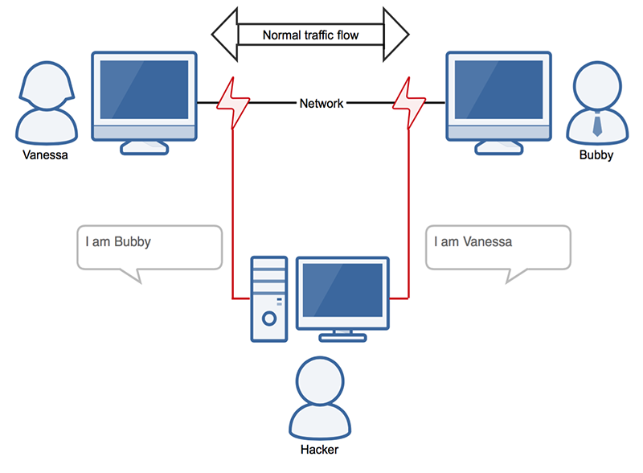

What is a network protocol?
A network protocol is a set of established rules that specify how to format, send and receive data so that computer network endpoints, including computers, servers, routers and virtual machines, can communicate despite differences in their underlying infrastructures, designs or standards.

To successfully send and receive information, devices on both sides of a communication exchange must accept and follow protocol conventions. In networking, support for protocols can be built into the software, hardware or both.

Without network protocols, computers and other devices would not know how to engage with each other. As a result, except for specialty networks built around a specific architecture, few networks would be able to function, and the internet as we know it wouldn't exist. Virtually all network end users rely on network protocols for connectivity.

How network protocols work: The OSI model
Network protocols break larger processes into discrete, narrowly defined functions and tasks across every level of the network. In the standard model, known as the Open Systems Interconnection (OSI) model, one or more network protocols govern activities at each layer in the telecommunication exchange. Lower layers deal with data transport, while the upper layers in the OSI model deal with software and applications.

To understand how network protocols function, it's crucial to understand the workings of the seven layers of the OSI model:

Physical layer. The physical layer is the initial layer that physically connects two interoperable systems. It controls simplex or duplex modem transmissions and transfers data in bits. Additionally, it oversees the hardware that connects the network interface card (NIC) to the network, including the wiring, cable terminators, topography and voltage levels.
Data-link layer. The data-link layer is responsible for the error-free delivery of data from one node to another over the physical layer. It's also the firmware layer of the NIC. It puts datagrams together into frames and gives each frame the start and stop flags. Additionally, it fixes issues brought on by broken, misplaced or duplicate frames.
Network layer. The network layer is concerned with information flow regulation, switching and routing between workstations. Additionally, it divides up datagrams from the transport layer into error-free and smaller datagrams.
Transport layer. The transport layer transfers services from the network layer to the application layer and breaks down data into data frames for error checking at the network segment level. This also ensures that a fast host on a network doesn't overtake a slower one. Essentially, the transport layer ensures that the entire message is delivered from beginning to end. It also confirms a successful data transmission and retransmitting of the data if an error is discovered.
Session layer. The session layer establishes a connection between two workstations that need to communicate. In addition to ensuring security, this layer oversees connection establishment, session maintenance and authentication.
Presentation layer. The presentation layer is also known as the translation layer because it retrieves the data from the application layer and formats it for transmission over the network. It addresses the proper representation of data, including the syntax and semantics of information. The presentation layer is also in charge of managing file-level security and transforming data to network standards.
Application layer. The application layer, which is the top layer of the network, oversees relaying user application requests to lower levels. File transfer, email, remote login, data entry and other common applications take place at this layer.
the OSI model
Diagram showing the seven layers of the OSI model for how applications communicate over a network
Every packet transmitted and received over a network contains binary data. Most computing protocols add a header at the beginning of each network packet to store information about the sender and the message's intended destination. Some protocols may also include a footer at the end with additional information. Network protocols process these headers and footers as part of the data moving among devices in order to identify messages of their own kind.

Network protocols are often outlined in an industry standard -- developed, defined and published by groups such as the following:

International Telecommunication Union, or ITU.
Institute of Electrical and Electronics Engineers, or IEEE.
Internet Engineering Task Force, or IETF.
International Organization for Standardization, or ISO.
World Wide Web Consortium, or W3C.
The TCP/IP model
A set of cooperating network protocols is called a protocol suite. The Transmission Control Protocol/Internet Protocol (TCP/IP) suite, which is typically used in client-server models, includes numerous protocols across layers, such as the data, network, transport and application layers, working together to enable internet connectivity.

These include the following:

TCP uses a set of rules to exchange messages with other internet points at the information packet level.
User Datagram Protocol, or UDP, acts as an alternative communication protocol to TCP and is used to establish low-latency and loss-tolerating connections between applications and the internet.
IP uses a set of rules to send and receive messages at the level of IP addresses.
Additional network protocols, including Hypertext Transfer Protocol (HTTP) and File Transfer Protocol (FTP), have defined sets of rules to exchange and display information. Unlike the OSI model, the TCP/IP suite consists of four layers, each with its protocols. The four layers of the TCP/IP model are the following:

Application layer. This is the topmost layer of the TCP/IP model and is responsible for providing users with access to network resources. Some of the protocols included in this layer are HTTP, Simple Mail Transfer Protocol (SMTP) and FTP.
Transport layer. This layer ensures that segments are transmitted correctly via the communication channel. The network link between the source and destination systems is also established at this layer.
Internet layer. Also known as the network layer, the internet layer receives and sends packets for the network. This layer comprises IP, Address Resolution Protocol (ARP) and Internet Control Message Protocol (ICMP).
Network access layer. The network access layer of TCP/IP combines the physical and data-link layers of the OSI model. It deals with Layer 1 concerns, such as energy, bits and the media used to transport them, such as copper, fiber and wireless. Additionally, it deals with Layer 2 difficulties, including bit conversion into protocol units, such as Ethernet packets, media access control (MAC) addresses and NICs.
